# Splunk SIEM Security Monitoring & BOTSv3 Investigation

## Project Overview

This project focused on using **Splunk Enterprise as a SIEM** to analyze Windows security activity, firewall traffic, endpoint processes, Microsoft 365 activity, authentication events, and the **Boss of the SOC Version 3 (BOTSv3)** security dataset. 

As a SOC Analyst, it is important to understand activity from the attackers point of view and search through the logs in the SIEM {in this case Splunk} to find out what they were doing and how we can remediate their suspicious activities. 

The lab started with Windows event and firewall monitoring and then moved into a larger security investigation using BOTSv3.

During the investigation, I used **SPL (Search Processing Language)** to search large datasets, filter events, correlate multiple log sources, investigate suspicious processes, analyze user activity, reconstruct timelines, create reports, and build Splunk dashboards.

---

## Tools and Technologies

- Splunk Enterprise
- Splunk Search & Reporting
- Splunk SPL
- Windows Security Event Logs
- Windows Firewall Logs
- Microsoft 365 / Azure AD Sign-In Logs
- OneDrive and SharePoint Logs
- Boss of the SOC Version 3 (BOTSv3)
- Splunk Reports
- Splunk Dashboards
- Windows Event IDs ***(name atleast 3)
- Event correlation and timeline analysis

---

# Part 1 — Windows Security and Firewall Monitoring

## Network Traffic Analysis

I started by analyzing network traffic stored in Splunk.

One of the SPL searches I used was:

```spl
index=main Destination_Address="*.*"
| stats count by Destination_Address, Source_Address
```

This allowed me to group network activity by **source and destination IP address** and identify communication patterns.

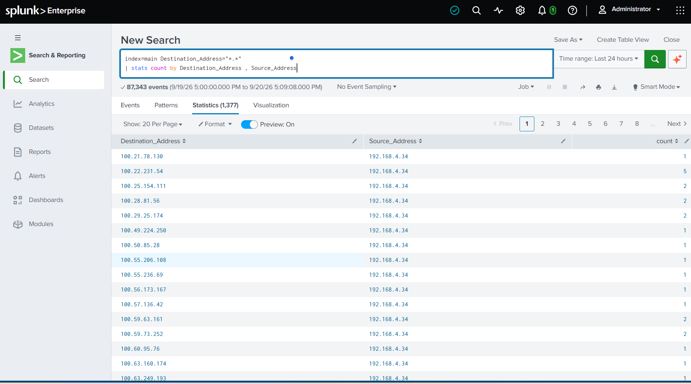

This helped me practice using the `stats` command to turn raw events into information that was easier to investigate.

---

## Windows Process Creation Analysis

I investigated Windows process creation activity using **Event ID 4688**.

```spl
index=main EventCode=4688
```

Event ID 4688 records when a new process is created on a Windows system.

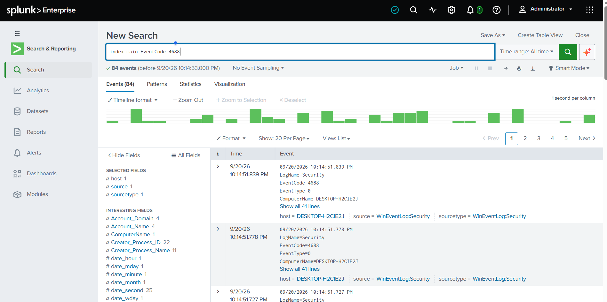

I also searched for PowerShell activity:

```spl
index=main powershell
```

I then narrowed the search further:

```spl
index=main EventCode=4688 "*powershell*"
```

This helped me understand how a SOC analyst can use Windows process creation events to investigate programs and commands executed on an endpoint.

---

## Process and Account Correlation

I used SPL to determine which processes were associated with specific Windows accounts.

```spl
index=main Account_Name="*"
| stats count by Creator_Process_Name, Account_Name
```

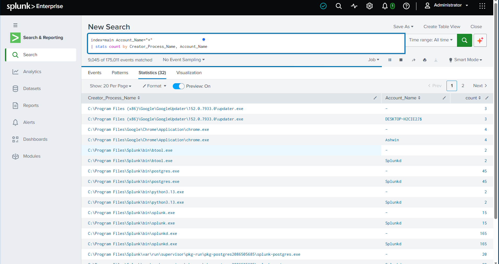

This grouped events by:

- Creator process
- User account
- Number of events

This made it easier to identify which accounts were associated with specific process activity.

---

## Firewall Traffic Analysis

I investigated Windows firewall events to separate **blocked traffic** from **allowed traffic**.

For blocked activity, I searched:

```spl
index=main *blocked*
```

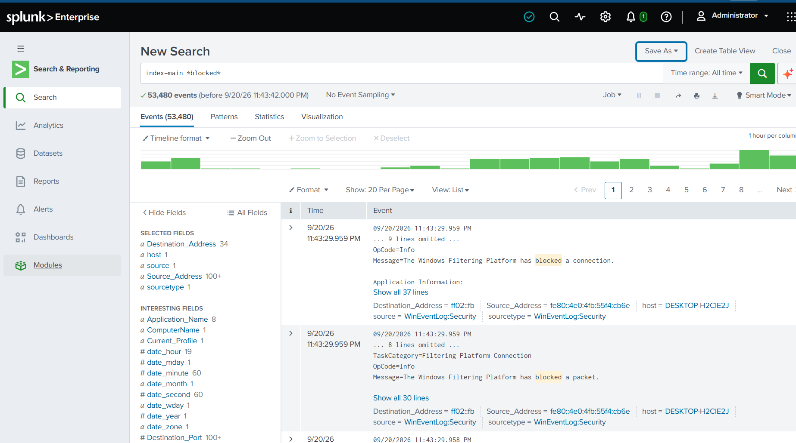

I created a Splunk Event Type named:

```text
blocked firewall traffic
```

I also searched for permitted firewall activity and created a separate event type for:

```text
Allowed firewall traffic
```

Creating event types allowed me to categorize firewall events instead of repeatedly searching through raw logs.

---

## Firewall Analysis Dashboard

I created a Splunk dashboard called:

**Firewall Analysis 2**

The dashboard included information such as:

- Source IP address
- Source port
- Destination IP address
- Destination port
- Firewall event type
- Computer name
- Event count
- Allowed versus blocked firewall traffic

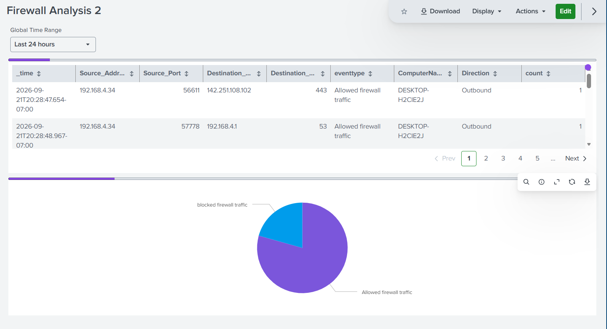

The dashboard provided a faster way to review firewall activity instead of manually examining individual raw events.

---

# Part 2 — BOTSv3 Security Investigation

## BOTSv3 Dataset

For the second part of the project, I used the **Boss of the SOC Version 3 dataset**.

BOTSv3 contains realistic security telemetry designed for SOC investigations and threat hunting.

I loaded the dataset into Splunk and worked primarily with the:

```text
botsv3
```

index.

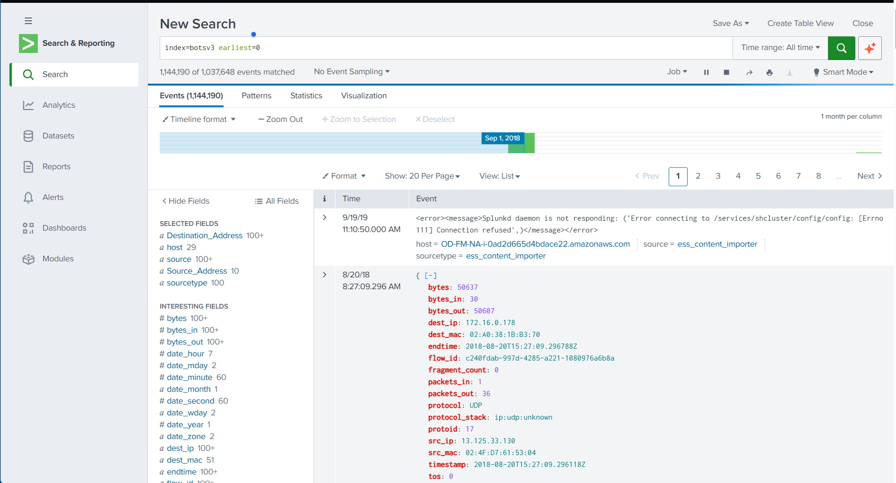

This gave me experience working with a much larger dataset containing multiple types of security telemetry.

---

## Discovering Available Log Sources

Before beginning the investigation, I explored the available sourcetypes.

One SPL search I used was:

```spl
index=botsv3 earliest=0
| stats count by sourcetype
```

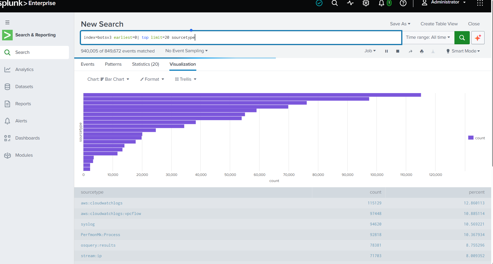

I also experimented with commands such as:

```spl
index=botsv3 earliest=0
| top limit=20 sourcetype
```

This helped me identify the different types of logs available before deciding where to investigate.

This is important during a SOC investigation because the analyst first needs to understand what telemetry is available.

---

# Suspicious Dropbox Process Investigation

During the endpoint investigation, I searched for Dropbox-related activity.

```spl
index=botsv3 earliest=0 "*Dropbox*"
```

I identified activity involving **DropboxUpdate.exe** on the system `BGIST-L`.

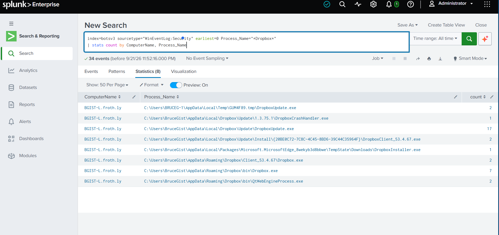

The investigation became more interesting when I discovered that one instance of `DropboxUpdate.exe` was running from a temporary directory instead of the normal Dropbox installation directory.

The suspicious process path was:

```text
C:\Users\BRUCEG~1\AppData\Local\Temp\GUM4F89.tmp\DropboxUpdate.exe
```

A legitimate-looking executable running from an unusual temporary directory can be important during an investigation because malware can sometimes use trusted or familiar names to blend in with legitimate software.

---

## Correlating Dropbox Windows Events

I narrowed the investigation using Windows Security logs.

```spl
index=botsv3 sourcetype="WinEventLog:Security" earliest=0 Process_Name="*DropboxUpdate.exe"
| where like(Process_Name, "%Temp%")
| table _time ComputerName Account_Name Process_Name EventCode
```

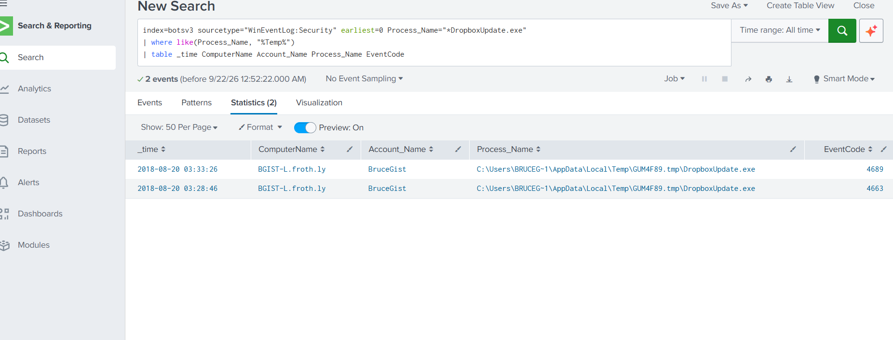

The results connected the suspicious executable with:

- Computer: `BGIST-L.froth.ly`
- Account: `BruceGist`
- Process: `DropboxUpdate.exe`
- Temporary execution path
- Windows Event IDs including `4663` and `4689`

This allowed me to correlate a suspicious process with a specific user account and endpoint.

---

## Windows Event 4663 Investigation

I then examined **Windows Event ID 4663**.

Event ID 4663 records an attempt to access an object such as a file.

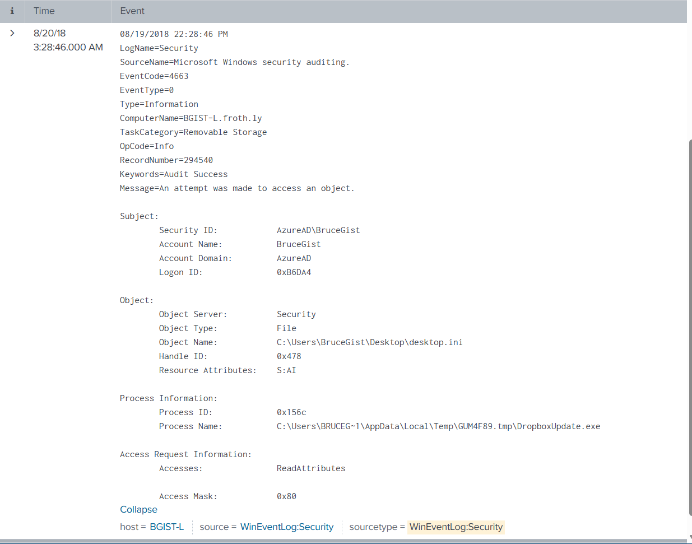

The event showed information including:

```text
Account Name: BruceGist
Process Name: C:\Users\BRUCEG~1\AppData\Local\Temp\GUM4F89.tmp\DropboxUpdate.exe
Object Type: File
```

This provided additional evidence connecting the suspicious Dropbox process with file access activity on Bruce's workstation.

Instead of stopping after finding the executable, I used another log source to understand what the process was doing.

---

# Suspicious Email Investigation

I expanded the investigation by searching for references to **Bruce** and **birthday**.

```spl
index=botsv3 *bruce* OR *birthday*
```

This broad search returned multiple events and eventually led me to an email artifact.

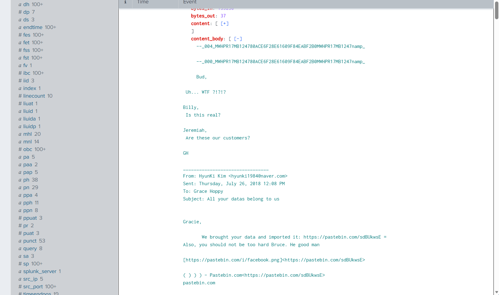

The email contained information including:

```text
From: HyunKi Kim <hyunki1984@naver.com>
To: Grace Hoppy
Subject: All your datas belong to us
```

The email body referenced stolen data and also mentioned Bruce.

This demonstrated how Splunk could be used to investigate more than Windows logs. Email telemetry provided another piece of evidence that could be correlated with the endpoint and cloud activity.

---

# Hong Kong Authentication Investigation

I investigated Azure AD sign-in activity associated with Hong Kong.

```spl
index=botsv3 sourcetype="ms:aad:signin" location.country="HK"
```

The search returned **27 events**.

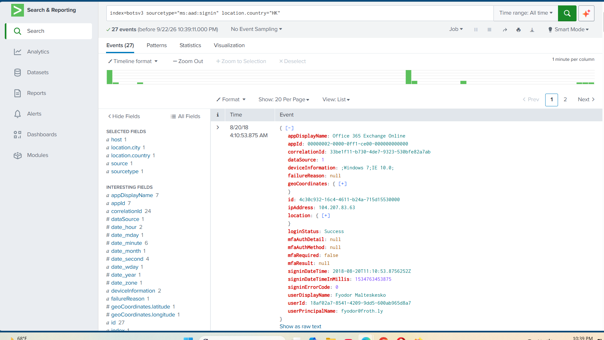

One of the events showed information including:

```text
ipAddress: 104.207.83.63
location.country: HK
loginStatus: Success
mfaRequired: false
userPrincipalName: fyodor@froth.ly
```

This gave me an important indicator:

```text
104.207.83.63
```

I could then use this IP address to pivot into other data sources.

---

# Account and MFA Analysis

I investigated which accounts and Microsoft applications were associated with the IP address.

```spl
index=botsv3 earliest=0 "104.207.83.63"
| stats count by userPrincipalName, appDisplayName, location.country, mfaRequired
```

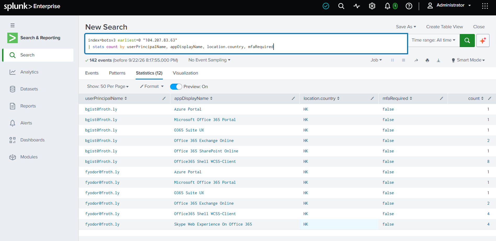

The results showed activity involving accounts including:

```text
bgist@froth.ly
fyodor@froth.ly
```

Applications included:

- Azure Portal
- Microsoft Office 365 Portal
- O365 Suite UX
- Office 365 Exchange Online
- Office 365 SharePoint Online
- Office365 Shell WCSS-Client
- Skype Web Experience on Office 365

The events also showed:

```text
location.country = HK
mfaRequired = false
```

This allowed me to analyze **identity, location, application usage, IP address, and MFA status together**.

---

# SharePoint and Birthday Photo Activity

I used the suspicious IP address to search for additional Microsoft 365 activity.

One of the searches used during the investigation was:

```spl
index=botsv3 *"104.207.83.63"* SourceFileName="*"
```

This revealed SharePoint and OneDrive activity.

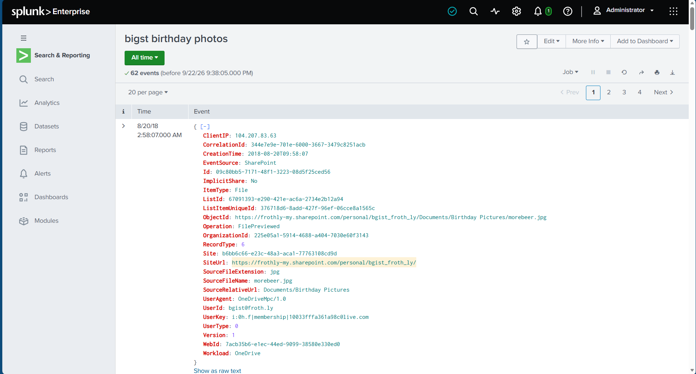

One event contained information including:

```text
ClientIP: 104.207.83.63
EventSource: SharePoint
SourceFileName: morebeer.jpg
SourceRelativeUrl: Documents/Birthday Pictures
UserId: bgist@froth.ly
Workload: OneDrive
```

This connected the investigated IP address with activity involving Bruce Gist's Microsoft 365 files.

---

# BGIST and FYODOR IP Correlation

I then searched across the BOTSv3 dataset for activity involving the IP address.

```spl
index=botsv3 *"104.207.83.63"*
| stats count by ClientIP, UserId, Workload
```

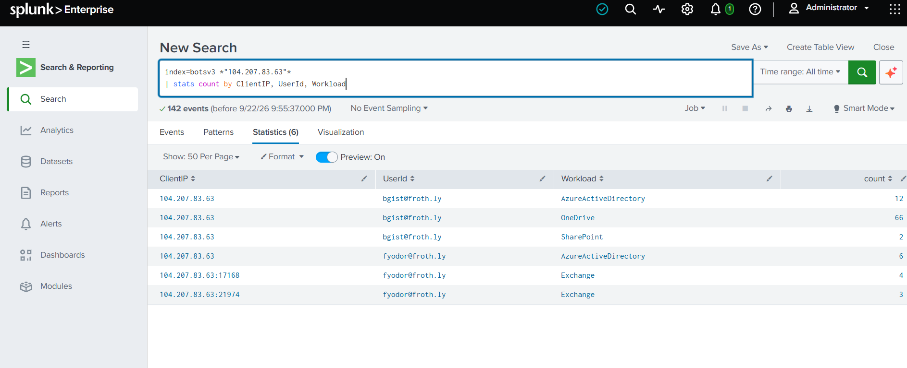

The results showed the same IP associated with both:

```text
bgist@froth.ly
fyodor@froth.ly
```

The IP appeared across multiple Microsoft workloads, including:

```text
AzureActiveDirectory
OneDrive
SharePoint
Exchange
```

This was an important correlation step because a single IP address connected multiple user identities and cloud services.

---

# Timeline Reconstruction

I added `_time` to the correlation search so I could determine **when each activity occurred**.

```spl
index=botsv3 *"104.207.83.63"*
| stats count by _time, ClientIP, UserId, Workload
```

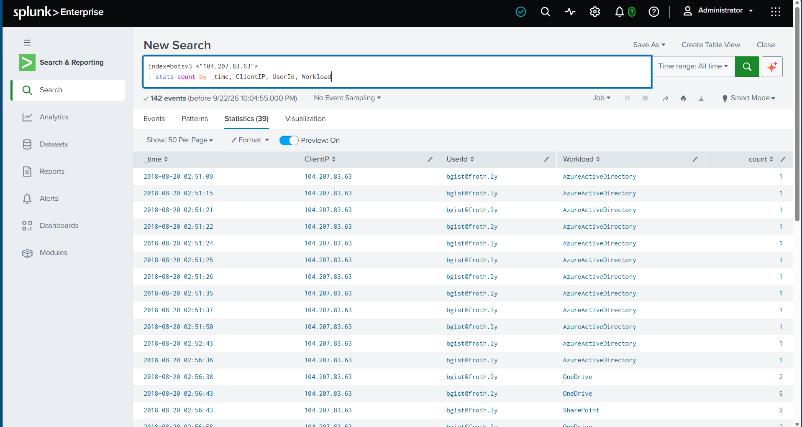

Adding `_time` transformed the aggregated results into a timeline.

Instead of only knowing that the activity happened, I could now examine the **sequence of events** across Azure Active Directory, OneDrive, SharePoint, and Exchange.

This helped me practice one of the most important incident response skills: **timeline reconstruction**.

---

# Bruce Analysis Dashboard

I saved the correlation searches as reports and added the investigation results to a Splunk dashboard called:

**Bruce Analysis**

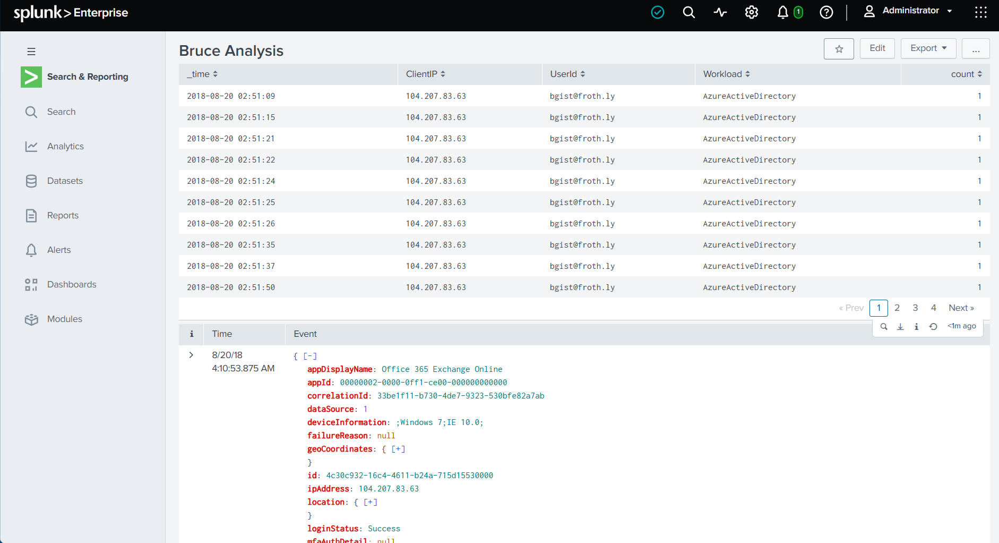

The dashboard provided a centralized view of the investigation.

It included information such as:

- Time
- Client IP
- User ID
- Microsoft workload
- Event count
- Hong Kong sign-in activity

Instead of repeatedly running individual searches, the dashboard provided a reusable view of the correlated evidence.

---

# Key Investigation Findings

During the investigation, the IP address:

```text
104.207.83.63
```

became an important indicator.

It appeared across multiple datasets and Microsoft services.

The investigation associated the IP with activity involving:

```text
bgist@froth.ly
fyodor@froth.ly
```

and workloads including:

```text
AzureActiveDirectory
Exchange
OneDrive
SharePoint
```

The investigation also identified:

- Successful Hong Kong authentication events
- Sign-in events where MFA was shown as not required
- Microsoft 365 activity involving multiple user accounts
- SharePoint and OneDrive activity involving birthday pictures
- A suspicious email referencing stolen data and Bruce
- Dropbox activity on Bruce's workstation
- `DropboxUpdate.exe` executing from a temporary directory
- Windows Event ID 4663 file-access activity associated with the suspicious process
- Multiple Microsoft cloud services associated with the same investigated IP address

The important part of the investigation was not any single event.

The stronger picture came from **correlating multiple log sources together**.

---

# SPL Searches Used

Throughout the lab, I used multiple SPL search patterns and commands.

### Basic Search

```spl
index=main
```

### Destination and Source Address Analysis

```spl
index=main Destination_Address="*.*"
| stats count by Destination_Address, Source_Address
```

### Windows Process Creation

```spl
index=main EventCode=4688
```

### PowerShell Search

```spl
index=main powershell
```

### PowerShell Process Creation

```spl
index=main EventCode=4688 "*powershell*"
```

### Process and Account Correlation

```spl
index=main Account_Name="*"
| stats count by Creator_Process_Name, Account_Name
```

### Blocked Firewall Activity

```spl
index=main *blocked*
```

### BOTSv3 Sourcetype Discovery

```spl
index=botsv3 earliest=0
| stats count by sourcetype
```

### Dropbox Discovery

```spl
index=botsv3 earliest=0 "*Dropbox*"
```

### Suspicious Dropbox Temp Execution

```spl
index=botsv3 sourcetype="WinEventLog:Security" earliest=0 Process_Name="*DropboxUpdate.exe"
| where like(Process_Name, "%Temp%")
| table _time ComputerName Account_Name Process_Name EventCode
```

### Bruce and Birthday Search

```spl
index=botsv3 *bruce* OR *birthday*
```

### Hong Kong Sign-In Search

```spl
index=botsv3 sourcetype="ms:aad:signin" location.country="HK"
```

### Account and MFA Correlation

```spl
index=botsv3 earliest=0 "104.207.83.63"
| stats count by userPrincipalName, appDisplayName, location.country, mfaRequired
```

### SharePoint File Investigation

```spl
index=botsv3 *"104.207.83.63"* SourceFileName="*"
```

### IP, User, and Workload Correlation

```spl
index=botsv3 *"104.207.83.63"*
| stats count by ClientIP, UserId, Workload
```

### Timeline Reconstruction

```spl
index=botsv3 *"104.207.83.63"*
| stats count by _time, ClientIP, UserId, Workload
```

---

# What I Learned

This project helped me understand how a SOC analyst can move from a broad search into a focused investigation.

I learned how to:

- Search large datasets using SPL
- Filter raw security events
- Use `stats` to summarize large numbers of events
- Use `table` to display important investigation fields
- Use `where` to narrow results
- Search across multiple sourcetypes
- Investigate Windows Event IDs
- Analyze Windows process creation
- Investigate file access activity
- Identify unusual executable paths
- Correlate processes with user accounts
- Analyze source and destination IP addresses
- Investigate Windows firewall activity
- Create Splunk Event Types
- Compare blocked and allowed firewall traffic
- Investigate Azure AD sign-in activity
- Analyze authentication locations
- Review MFA information
- Investigate Microsoft 365 application activity
- Analyze OneDrive and SharePoint events
- Investigate email artifacts
- Pivot from one indicator into other log sources
- Correlate IP addresses with users and applications
- Reconstruct security timelines using `_time`
- Save searches as Splunk reports
- Build dashboards from investigation results

The biggest lesson from this lab was that **one log entry rarely tells the entire story**.

The investigation became much clearer when I pivoted between:

**IP addresses → user accounts → applications → endpoints → processes → files → email → cloud activity → timestamps**

That correlation process allowed me to turn separate security events into a larger investigation timeline.

---

# Skills Demonstrated

- Splunk Enterprise
- Security Information and Event Management (SIEM)
- Search Processing Language (SPL)
- SOC Investigation
- Security Monitoring
- Threat Hunting
- Windows Event Log Analysis
- Windows Event ID Analysis
- Process Analysis
- Endpoint Investigation
- Firewall Analysis
- Network Traffic Analysis
- Azure AD Sign-In Analysis
- Microsoft 365 Security Analysis
- OneDrive Investigation
- SharePoint Investigation
- Email Investigation
- Indicator Pivoting
- Event Correlation
- Timeline Reconstruction
- Incident Investigation
- Splunk Reports
- Splunk Dashboards
